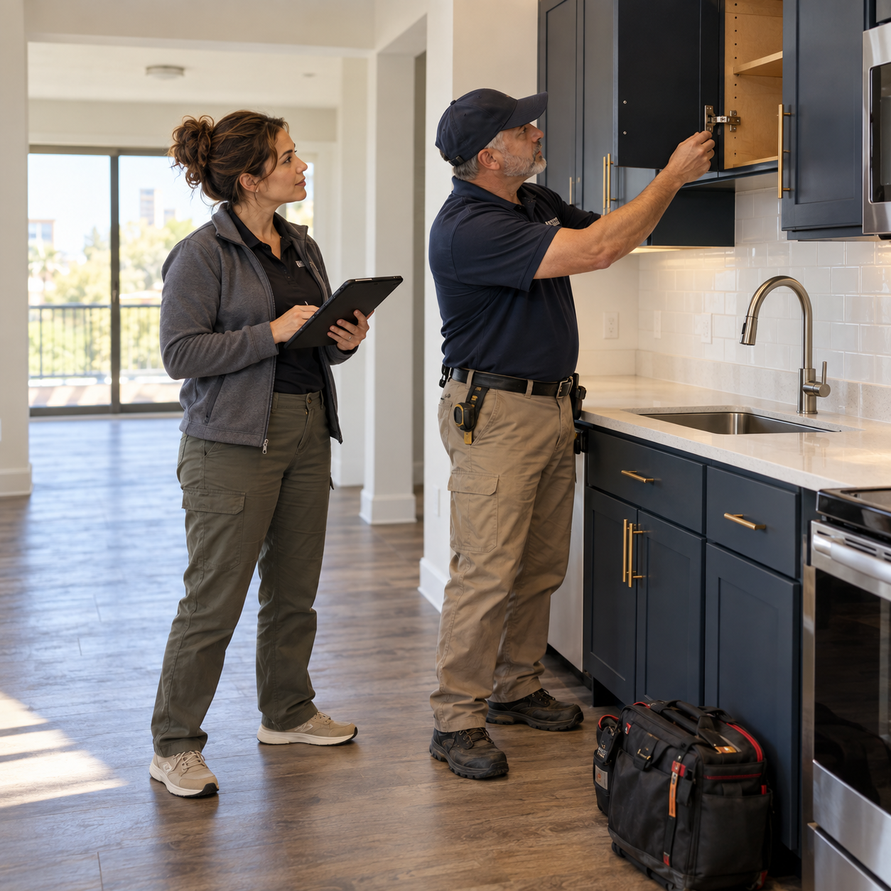
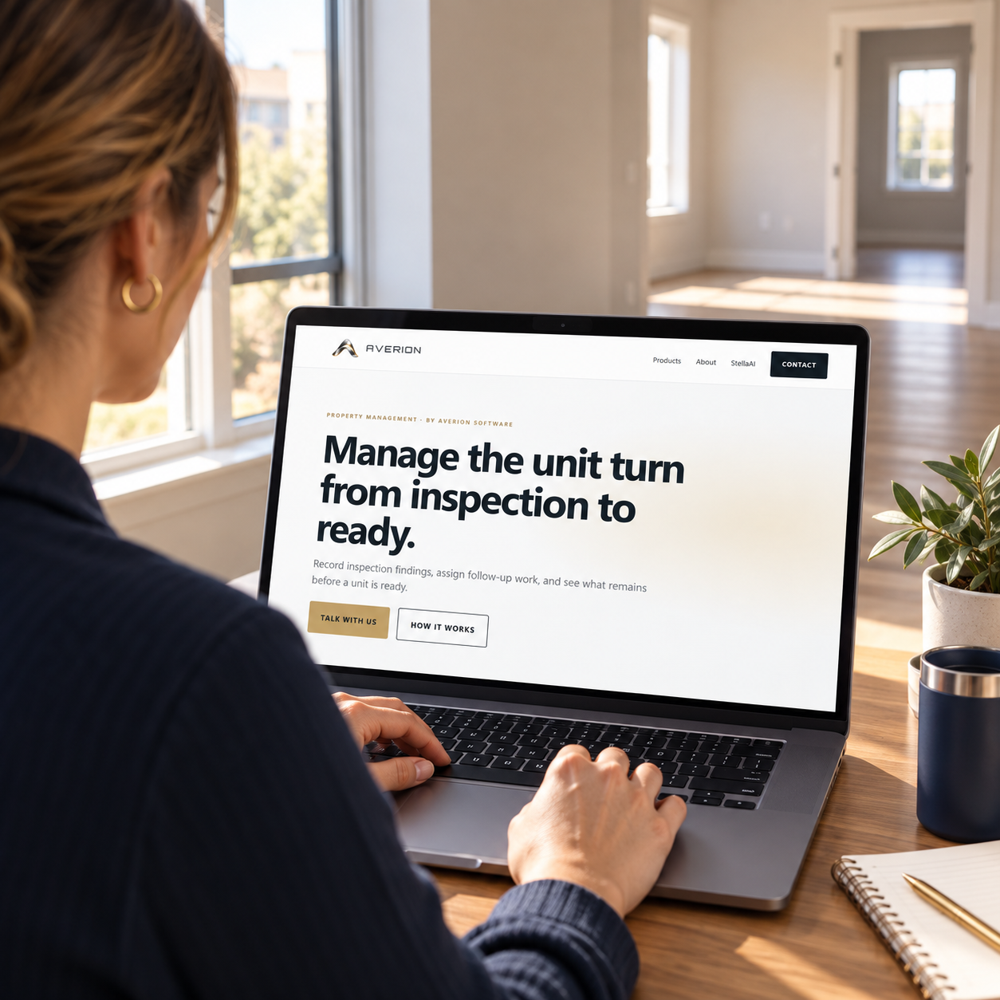
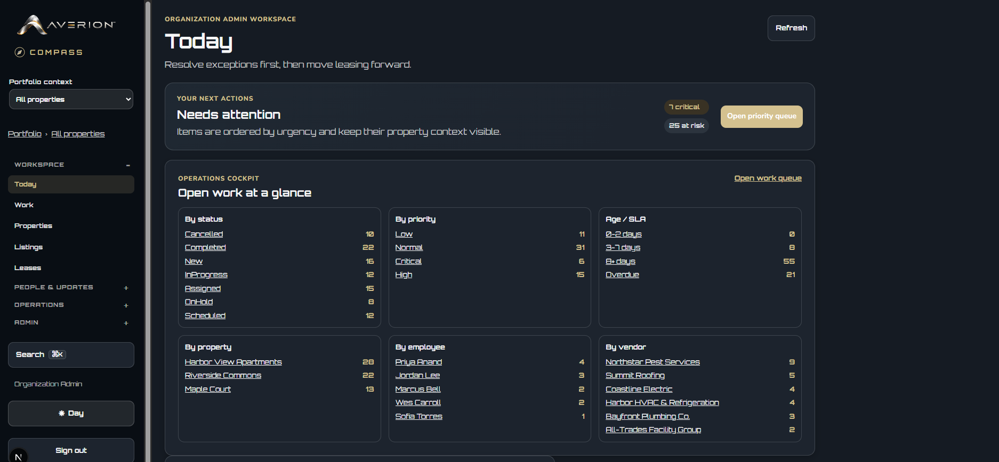
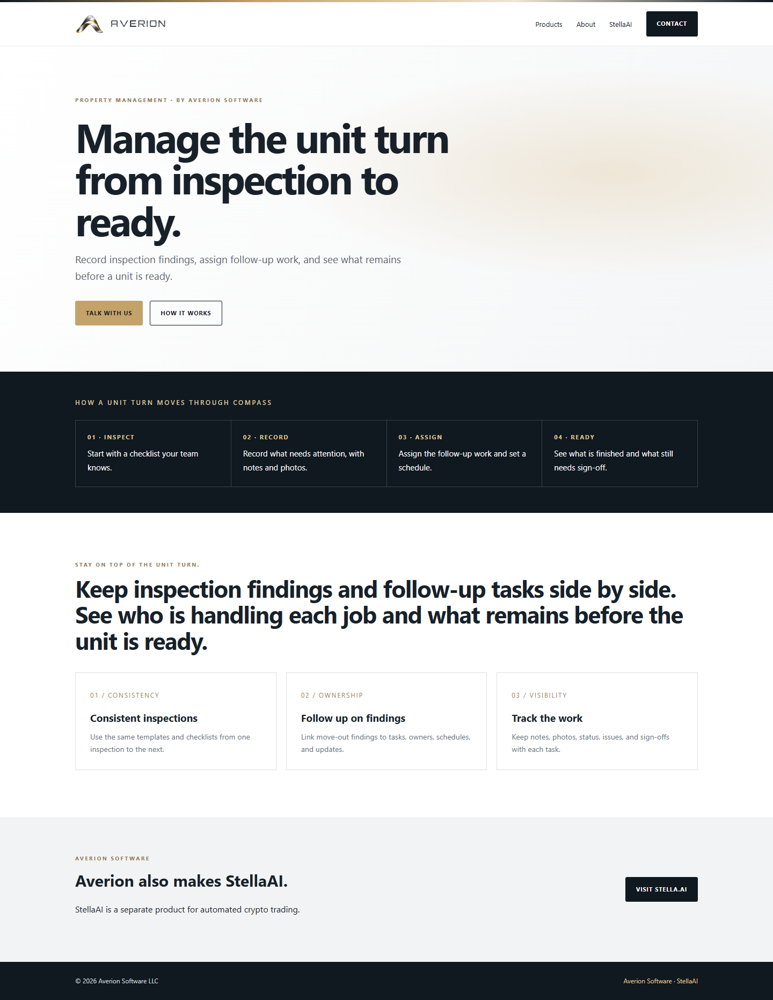
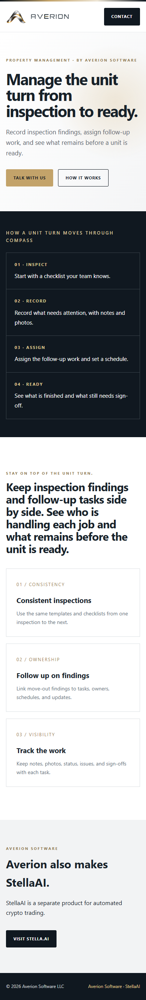

# Social asset visual catalog

Seven assets: four generated scenes ready for drafting, one application screenshot on hold, and two website screenshot references. [Agent guide](README.md) · [Machine-readable manifest](catalog.json) · [Usage ledger](usage.csv) · [Exact generation prompts](prompts.json)

## AC-G001 — Office planning

**READY** · 1254 × 1254 · generated_scene

[Open original image](images/AC-G001-office-planning.png)

- **Use for:** Morning planning, workload discussions, or coordinating the day.
- **Tags:** office, prioritization, staff-workload, teamwork
- **Alt text:** AI-generated illustration of two property operations colleagues reviewing a laptop in a sunlit office.
- **Source:** Generated 2026-09-30 with built-in image_gen.
- **Use conditions:** No readable product interface; do not imply these are actual Averion employees.
- **Caption disclosure:** Illustrative scene created with AI

## AC-G002 — Unit inspection

**READY** · 1254 × 1254 · generated_scene

[Open original image](images/AC-G002-unit-inspection.png)

- **Use for:** Inspection findings, practical checklists, and coordinating follow-up work.
- **Tags:** field, inspection, unit-turn, maintenance, follow-up
- **Alt text:** AI-generated illustration of a coordinator holding a tablet while a technician examines a cabinet in a vacant apartment.
- **Source:** Generated 2026-09-30 with built-in image_gen.
- **Use conditions:** Tablet display is hidden; this does not demonstrate a mobile app or integration.
- **Caption disclosure:** Illustrative scene created with AI

## AC-G003 — Resident handover

**READY** · 1254 × 1254 · generated_scene

[Open original image](images/AC-G003-resident-handover.png)

- **Use for:** Resident communication, move-in preparation, or thoughtful handovers.
- **Tags:** resident-communication, handover, leasing, community
- **Alt text:** AI-generated illustration of a property manager handing keys to an adult resident across an office desk.
- **Source:** Generated 2026-09-30 with built-in image_gen.
- **Use conditions:** No testimonial or actual customer relationship implied.
- **Caption disclosure:** Illustrative scene created with AI

## AC-G004 — Compass on site

**READY** · 1254 × 1254 · generated_product_context

[Open original image](images/AC-G004-compass-on-site.png)

- **Use for:** Introducing Compass's unit-turn positioning or inviting readers to explore the product page.
- **Tags:** product, field, unit-turn, brand, website
- **Alt text:** AI-generated illustration of a property manager viewing the Averion Compass marketing webpage on a laptop in a vacant apartment.
- **Source:** Generated 2026-09-30 using the public website capture from 2026-09-24.
- **Use conditions:** Generated reconstruction of a marketing webpage in a fictional setting, not an app screenshot. Use for brand context; screenshot reference is dated.
- **Caption disclosure:** Illustrative scene created with AI

## AC-S001 — Compass dashboard reference

**HOLD** · 1874 × 867 · application_screenshot

[Open original image](images/AC-S001-dashboard.png)

- **Use for:** After clearance: a walkthrough of the visible Today dashboard.
- **Tags:** product, dashboard, work-queue, prioritization
- **Alt text:** Averion Compass Today dashboard with work grouped by status, priority, age, property, employee, and vendor.
- **Source:** Copied unchanged from ../font-research/compass-dashboard-reference.png; original capture date and environment unknown.
- **Use conditions:** Product owner must confirm current interface and synthetic or cleared named records before public use. Counts are not performance claims.

## AC-S002 — Compass webpage desktop

**REFERENCE** · 1440 × 1862 · website_screenshot

[Open original image](images/AC-S002-compass-web-desktop.png)

- **Use for:** Reference for a reviewed feed crop or product-page walkthrough.
- **Tags:** product, website, unit-turn, desktop
- **Alt text:** Desktop capture of the Averion Compass webpage describing inspection findings and unit-turn follow-up.
- **Source:** Copied unchanged from ../website-screenshots/averion-compass-desktop.png; captured 2026-09-24 per source README.
- **Use conditions:** Full-page capture, not an application screenshot. Includes a separate StellaAI section; do not use full page for Compass-only feed posts. Prepare reviewed crop.

## AC-S003 — Compass webpage mobile

**REFERENCE** · 390 × 2665 · website_screenshot

[Open original image](images/AC-S003-compass-web-mobile.png)

- **Use for:** Reference for a reviewed mobile webpage crop.
- **Tags:** product, website, unit-turn, mobile
- **Alt text:** Mobile webpage capture of Averion Compass's unit-turn positioning and workflow overview.
- **Source:** Copied unchanged from ../website-screenshots/averion-compass-mobile.png; captured 2026-09-24 per source README.
- **Use conditions:** Narrow full-page website capture, not a mobile app. Prepare reviewed crop; avoid unrelated StellaAI section.

